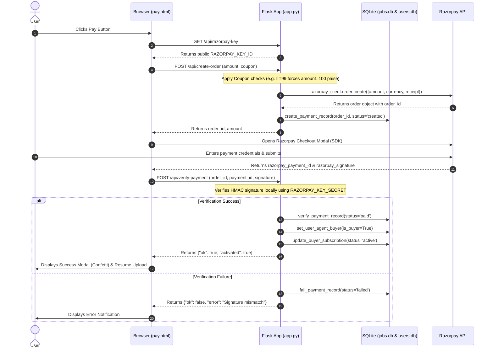

# User Acceptance Testing (UAT) - Razorpay API Integration

This document outlines the User Acceptance Testing (UAT) procedures for the **Razorpay Payment Gateway Integration & Subscription Engine** (Milestone 3) within the **IITIIM Job Assistant** platform.

It maps backend endpoints, database schemas, frontend interfaces, and verification procedures to verify successful payments and automatic account activation.

---

## 1. Architectural Overview & Security Boundary

To ensure PCI-DSS compliance and optimal security, the integration is designed with a clear separation of concerns:
*   **Zero Credentials in Code**: All API keys, secrets, and webhook tokens are loaded dynamically via environment variables (`.env`).
*   **Tokenized Client Checkout**: The customer's credit card or bank details are handled entirely inside the secure Razorpay Checkout overlay, communicating directly with Razorpay's servers. The client only receives signature tokens.
*   **HMAC-SHA256 Verification**: Payments are verified on the backend using local cryptographic matching of signatures to prevent client-side tampering (e.g., price spoofing).

---

## 2. Codebase Mapping & Function Directory

### Frontend (Checkout Interface)
*   **File**: [pay.html](file:///c:/Users/VIBUDH/Desktop/projects/job%20assistant/frontend/pay.html)
    *   `startPayment()`: Retrieves the public key, requests an order ID from the backend `/api/create-order`, configures the Razorpay options, opens the checkout modal, and submits the signature response to `/api/verify-payment`.
    *   `applyCoupon()`: Checks for the promotional code `IIT99`. If matching, triggers a client-side visualization of a ₹1 payment flow.
    *   `showResumeModal()`: Triggers a post-payment popup to let users upload their resume to complete onboarding.
    *   `uploadResume()`: Performs a multipart upload of the candidate's CV to `/api/agent-buyers` to initialize their outreach profile.

### Backend Routing (Flask Controller)
*   **File**: [app.py](file:///c:/Users/VIBUDH/Desktop/projects/job%20assistant/core/app.py)
    *   `razorpay_key()` (`GET /api/razorpay-key`): Exposes the public `RAZORPAY_KEY_ID` to the frontend.
    *   `create_order()` (`POST /api/create-order`): Accepts `amount`, `currency`, and `coupon` parameters. Creates a unique order via Razorpay API SDK (`razorpay_client.order.create`), logs the entry in SQLite database with state `'created'`, and returns the order metadata.
    *   `verify_payment()` (`POST /api/verify-payment`): Receives the payment signature, verifies it locally using HMAC-SHA256, marks the payment as `'paid'`, flags the user as `is_agent_buyer = 1`, and sets their linked agent profile subscription status to `'active'`.
    *   `razorpay_webhook()` (`POST /api/razorpay-webhook`): Receives real-time asynchronous callbacks from Razorpay. Validates the signature header (`X-Razorpay-Signature`) and parses the `payment.captured` event to asynchronously verify records.
    *   `list_payments()` (`GET /api/payments`): Exposes raw payment records for reporting/audit.

### Database Operations (SQL Engine)
*   **File**: [database.py](file:///c:/Users/VIBUDH/Desktop/projects/job%20assistant/core/database.py)
    *   `create_payment_record(...)`: Inserts a record containing the `razorpay_order_id`, amount (in paise), receipt ID, and buyer ID into the `payments` table.
    *   `verify_payment_record(...)`: Sets status to `'paid'` and records the `razorpay_payment_id`, signature, and `verified_at` timestamp.
    *   `fail_payment_record(...)`: Appends failure comments to the payment receipt and changes status to `'failed'`.
    *   `set_user_agent_buyer(...)`: Updates the `users` table to set `is_agent_buyer = 1`.
    *   `update_buyer_subscription(...)`: Updates the `agent_buyers` table to set `subscription_status = 'active'`.

---

## 3. Database Schema

Payments are tracked inside `jobs.db` using the following schema:
```sql
CREATE TABLE IF NOT EXISTS payments (
    id                  INTEGER PRIMARY KEY AUTOINCREMENT,
    razorpay_order_id   TEXT    UNIQUE NOT NULL, -- Razorpay Order Identifier (order_...)
    razorpay_payment_id TEXT    DEFAULT '',      -- Razorpay Payment Identifier (pay_...)
    razorpay_signature  TEXT    DEFAULT '',      -- HMAC verification token
    amount_paise        INTEGER NOT NULL,        -- Integer amount in paise (e.g. 100 paise = ₹1)
    currency            TEXT    NOT NULL DEFAULT 'INR',
    receipt             TEXT    DEFAULT '',      -- Unique internal merchant receipt code
    buyer_id            INTEGER,                 -- References agent_buyers.id
    status              TEXT    NOT NULL DEFAULT 'created', -- created | paid | failed
    verified_at         TEXT    DEFAULT '',      -- Timestamp of successful signature verification
    created_at          TEXT    NOT NULL         -- Timestamp of order request
);
```

---

## 4. Step-by-Step Payment Lifecycle



---

## 5. User Acceptance Testing (UAT) Procedures

Ensure the environment variables are configured in `.env` before beginning:
```bash
RAZORPAY_KEY_ID=rzp_test_... # Razorpay public key ID
RAZORPAY_KEY_SECRET=...      # Razorpay secret key
RAZORPAY_WEBHOOK_SECRET=...  # Webhook secret (for testing captured events)
```

### UAT Case 3.1: Promotional Checkout Flow (IIT99)
**Goal**: Verify that entering the test code `IIT99` reduces the cost to ₹1 and successfully triggers subscription activation.
1. Log in to the application as an approved user.
2. Navigate to `http://localhost:5000/pay`.
3. Verify that the billing section shows the default plan pricing (e.g., ₹8,850.00).
4. Enter `IIT99` into the Promo Code input box and click **Apply**.
5. **Expected Output**:
   * "Coupon applied successfully! 100% discount applied." banner appears.
   * Total due today changes to `₹1.00`.
   * The checkout button updates to "Pay ₹1 · Activate agent".
6. Click the **Pay** button.
7. Inside the Razorpay Checkout Modal:
   * Select **Netbanking** or **UPI** (using Dummy/Success simulators).
   * Complete the test transaction.
8. **Expected Output**:
   * Razorpay dialog closes automatically.
   * Page displays a green banner: "✓ Payment successful! Your subscription is active."
   * After 800ms, the Confetti animation triggers, and the Resume Upload Modal overlay opens.
9. Inspect `jobs.db` database records:
   * Run query: `SELECT * FROM payments WHERE status = 'paid';`
   * Confirm that `amount_paise = 100` and the status is `'paid'`.
10. Inspect `users.db` database records:
    * Run query: `SELECT is_agent_buyer FROM users WHERE id = <user_id>;`
    * Confirm that `is_agent_buyer` is equal to `1`.
    * Run query: `SELECT subscription_status FROM agent_buyers WHERE email = '<user_email>';`
    * Confirm that `subscription_status` is equal to `'active'`.

### UAT Case 3.2: Payment Cancellation Flow
**Goal**: Verify that when a user abandons the payment window, the system handles it gracefully and retains the record state.
1. Navigate to the checkout page `http://localhost:5000/pay`.
2. Click **Pay**.
3. Once the Razorpay overlay appears, click the close button (**[X]**) or press `Escape` to cancel the transaction.
4. **Expected Output**:
   * The checkout overlay disappears.
   * A status box is shown on screen saying: "Payment cancelled."
   * The main payment button is reset and re-enabled ("Pay ₹8,850 · Activate agent").
5. Inspect the database:
   * Run query: `SELECT status FROM payments WHERE razorpay_order_id = '<order_id>';`
   * Confirm that status remains `'created'` (does not transition to `'paid'`).

### UAT Case 3.3: Local Signature Mismatch Handling
**Goal**: Confirm that any tampered payment signature is detected and subscription activation is rejected.
1. Initiate a checkout flow and launch the Razorpay modal.
2. Intercept the HTTP request to `/api/verify-payment` using browser development tools (or mock using a curl utility) and tamper with the `razorpay_signature` parameter (e.g., replacing characters).
3. Send the request.
4. **Expected Output**:
   * The server logs: `[Razorpay] Signature mismatch for order order_...`.
   * Endpoint returns a `400 Bad Request` with `{"ok": false, "error": "Payment verification failed — signature mismatch"}`.
   * Database table record updates the status to `'failed'` (retaining the failure comments in the receipt field).
   * User registration is NOT upgraded (`is_agent_buyer` remains `0`).

### UAT Case 3.4: Asynchronous Webhook Verification
**Goal**: Validate that server-to-server webhook callbacks from Razorpay safely verify payments and match signatures.
1. Using an API testing utility (e.g., Postman/curl), mock a Razorpay POST payload matching the `payment.captured` schema.
2. Sign the request body using `RAZORPAY_WEBHOOK_SECRET` and assign it to the `X-Razorpay-Signature` header.
3. Send a POST request to `http://localhost:5000/api/razorpay-webhook`.
4. **Expected Output**:
   * Server validates the signature and logs event processing.
   * Response status is `200 OK` with JSON `{"ok": true}`.
   * Database `payments` record corresponding to the transaction updates status to `'paid'`.
