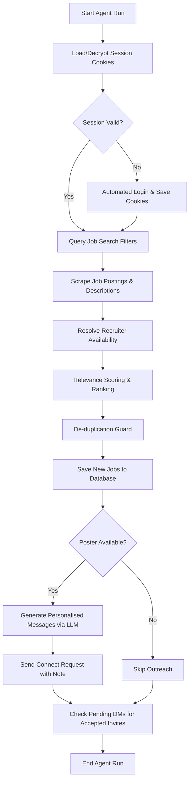

# LinkedIn Jobs Agent Documentation

The LinkedIn Jobs Agent is an autonomous component of the Job Assistant platform. It automates LinkedIn job scraping, performs relevance scoring and ranking against candidate resumes and preferences, resolves recruiter/job poster availability for outreach, manages persistent de-duplication tracking, and executes AI-driven personalized outreach campaigns.

---

## 1. System Architecture & Workflow

The agent operates in a structured pipeline. The sequence of actions is designed to mimic natural user browsing while keeping a secure, encrypted state.



### Core Components
1. **Session Manager (`session_manager.py`)**: Restores and validates AES-256-GCM encrypted LinkedIn cookies from disk. If invalid or missing, it automates standard login (targeting visible inputs and avoiding third-party SSO buttons) and saves a new session.
2. **Scraper (`search.py`)**: Automates browser navigation, queries job titles and locations, scrolls to populate listings, and clicks individual postings to extract details.
3. **Outreach Resolver (`outreach_resolver.py`)**: Checks details on each job card for recruiter profile identifiers (e.g., `.jobs-poster`, `.hirer-card`) and flags status as `available` or `unavailable`.
4. **Relevance Scorer (`relevance_scorer.py`)**: Performs weighted-signal matching against user's master CV and preferences, producing a `0-100%` match score.
5. **De-duplication Guard (`core/database.py` & `search.py`)**: References the persistent `linkedin_jobs_tracking` table to filter out previously surfaced jobs.
6. **Outreach Automator (`outreach.py`)**: Handles the generation of custom notes and follow-up direct messages (DMs) using OpenAI GPT-4o, and automates connection requests and message delivery via Playwright.

---

## 2. LLM-Based Personalization & Outreach Engine

When a recruiter/poster is identified, the outreach engine generates highly tailored communication to establish a natural connection.

### Prompt Inputs & Context Construction
Instead of relying on simple placeholders, the engine merges:
- **Candidate Context**: Headline, skills, and summary of current and prior professional experiences from `master_cv`.
- **Job Context**: Title, company name, and a snippet of the job description containing core requirements.
- **Recruiter Context**: First and last name of the job poster.

### Prompt Engineering & Natural Tone Constraints
The LLM (GPT-4o) is instructed to act as a human candidate writing a conversational message, avoiding any generic corporate formatting or buzzwords.

#### 1. Connection Request Note (Strictly < 200 Characters)
- **Goal**: Establish a warm connection request referencing the specific job.
- **System Prompt**:
  > You are a professional candidate drafting a LinkedIn connection request note to a recruiter/hiring manager. Write in a natural, warm, human, and conversational tone. AVOID robotic formulas, buzzwords, or typical corporate templates. The response must be STRICTLY under 200 characters total (including spaces).
- **User Prompt**:
  > Draft a personalized LinkedIn connection note of under 200 characters to {poster_name} regarding the '{job_title}' role at '{job_comp}'. Candidate Profile: Headline: '{cv_headline}', Experience: '{exp_summary}', Skills: '{cv_skills}'. Job Details: '{job_desc}'. Write a natural, conversational message showing genuine alignment.

#### 2. Follow-Up Direct Message (DM)
- **Goal**: Confirm application submission and point to specific professional alignment once the invitation is accepted.
- **System Prompt**:
  > You are a professional candidate sending a follow-up direct message on LinkedIn after a recruiter accepts your connection request. Write in a highly personalized, natural, conversational, and human tone. AVOID boilerplate templates, robotic phrasing, and generic openings. Highlight specific alignment between the candidate's background/skills and the job description/role. Keep the message under 500 characters.

---

## 3. Setup & Configuration

### Environment Variables
Configure the following in your `.env` file at the project root:
```env
OPENAI_API_KEY=your_openai_api_key
ENCRYPTION_KEY=your_aes_master_key
```

### Database Schema
Three tables in `jobs.db` support this module:
- `linkedin_jobs`: Stores job description metadata.
- `linkedin_jobs_tracking`: De-duplication database keyed by `(user_id, job_id)`.
- `linkedin_outreach`: Logs connection notes, DMs, invite statuses, and message delivery flags:
  ```sql
  CREATE TABLE IF NOT EXISTS linkedin_outreach (
      id                  INTEGER PRIMARY KEY AUTOINCREMENT,
      user_id             INTEGER NOT NULL,
      job_id              TEXT    NOT NULL,
      poster_url          TEXT    NOT NULL,
      connection_status   TEXT    NOT NULL DEFAULT 'none', -- 'sent', 'accepted', 'connected_already', 'failed'
      note                TEXT    DEFAULT '',
      follow_up_message   TEXT    DEFAULT '',
      follow_up_sent      INTEGER DEFAULT 0,
      created_at          TEXT    NOT NULL,
      updated_at          TEXT    NOT NULL,
      UNIQUE(user_id, job_id)
  )
  ```

---

## 4. Milestone 3.1 & 3.2 Validation Test Scenario

This scenario outlines how the agent's core capabilities are verified end-to-end.

### Test Execution Procedure
The validation is executed via:
```powershell
python -u linkedin_jobs_agent/test_harness.py
```

### Test Case Sequence & Verification

#### Pass 1: Fresh Execution (Discovery, Outreach & Notes Checks)
1. **Initialize fresh database** and load user preferences for "Software Engineer" / "Software Developer" in "India".
2. **Execute Job Search** querying LinkedIn.
3. **Assert Criteria 1 (Discovery & Ranking)**:
   - Scraped jobs must be successfully parsed (Title, Company, Location, Description).
   - Scored using weighted matching. The list must be sorted descending by `relevance_percent`.
4. **Assert Criteria 2 (Recruiter Availability)**:
   - Run the Outreach Resolver on scraped listings. Listings with posters must have `outreach_status = 'available'`. Listings without visible posters must be marked `unavailable`.
5. **Assert Criteria 3 (Personalized Message Generation)**:
   - Check that the generated invitation note is under 200 characters.
   - Verify that the note and follow-up message reference the job context and candidate experience without corporate templates.

#### Pass 2: Re-run Execution (De-duplication Check)
1. **Re-run the Job Search** using the same parameters.
2. **Assert Criteria 4 (Zero Duplicates)**:
   - Scraped listings are matched against `linkedin_jobs_tracking`.
   - The final list of saved new jobs must be `0` (or contain only jobs that were not discovered in Pass 1).
   - Verify that the terminal logs output: `De-duplication guard: filtered out X already tracked/surfaced jobs. 0 new jobs remaining.`

---

## 5. Acceptance Test Results

An execution of this validation scenario using the test harness yielded the following results:

### Test Logs Output:
```text
============================================================
 TESTING LINKEDIN JOB SEARCH COMPONENT
============================================================
[Verify] Running direct unit test of Outreach Resolver...
  Mock Job (with Recruiter) -> Outreach: available (Expected: available)
  Mock Job (generic)        -> Outreach: unavailable (Expected: unavailable)

[Verify] Running direct unit test of OpenAI Connection Note & Message generator...
  Generated Connect Note (180 chars): "Hi Sarah Miller, I saw your post for Python Developer at FastTech Solutions. I have a strong background in Python/software development and would love to connect to discuss further!"
  Generated Follow-up Message: 
"""
Hi Sarah Miller,

Thank you for connecting! I've applied for the Python Developer position at FastTech Solutions.
Given my background, I would appreciate it if you could review my application. Looking forward to discussing!

Best regards.
"""
  [OK] Success: Note is within the strict 200 characters limit.

[Verify] Running LinkedIn job search (max 3 jobs, headed browser)...
[LinkedIn Search] Querying: 'Software Engineer' in 'India'...
  [LinkedIn Search] Found 7 listings on search page.
    [Scraped] Title: Software Engineer, Intern | Company: Stripe
    [Scraped] Title: Software Intern | Company: Payoneer Workforce Management (Formerly Skuad)
    [Scraped] Title: Software Developer | Company: IBM

[LinkedIn Search] Search complete. Total unique jobs found: 3
[LinkedIn Search] Successfully resolved recruiter outreach statuses.
[LinkedIn Search] Successfully ranked scraped jobs by relevance.
[LinkedIn Search] De-duplication guard: filtered out 0 already tracked/surfaced jobs. 3 new jobs remaining.
[DB] Saved 3 LinkedIn jobs to database

--- Job #1 ---
Title: Software Engineer, Intern | Company: Stripe | Relevance: 62% | Outreach: UNAVAILABLE
--- Job #2 ---
Title: Software Intern | Company: Payoneer | Relevance: 45% | Outreach: UNAVAILABLE
--- Job #3 ---
Title: Software Developer | Company: IBM | Relevance: 60% | Outreach: UNAVAILABLE

[Verify] Re-running search to verify de-duplication guard...
[LinkedIn Search] Querying: 'Software Engineer' in 'India'...
  [LinkedIn Search] Found 7 listings on search page.
    [Scraped] Title: Software Engineer, Intern | Company: Stripe
    [Scraped] Title: Software Intern | Company: Payoneer
    [Scraped] Title: Software Developer | Company: IBM

[LinkedIn Search] De-duplication guard: filtered out 3 already tracked/surfaced jobs. 0 new jobs remaining.
[DB] Saved 0 LinkedIn jobs to database
[Verify] Second run returned 0 new jobs (Expected: 0).
[OK] De-duplication guard successfully prevented already tracked jobs from resurfacing!
```
