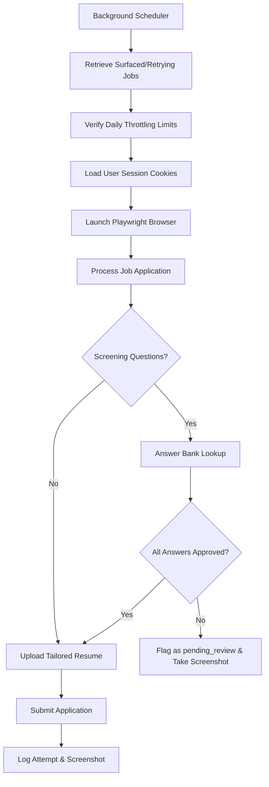

# Naukri AI Auto-Apply Agent Documentation

This document outlines the architecture, components, and validation strategies for the automated Naukri Job Application Agent.

---

## 1. System Architecture

The Naukri AI Auto-Apply Agent operates as an autonomous background pipeline executing per-user schedules. The workflow integrates crawling, job matching, resume customization, form interaction, and audit logging.

---

## 2. Core Functional Modules

### A. Resume Tailoring
- **Purpose**: Tailors candidate resumes specifically to the target job description to maximize relevance scores.
- **Workflow**:
  - The system checks if a customized PDF variant of the resume exists for the specific target job.
  - If not, it runs the PDF tailor component which maps user metadata, target role classifications, and customized experience items to generate a matching variant.
  - The tailored PDF path is stored in the database (`naukri_applications.tailored_resume_path`) and uploaded directly during the Playwright browser session.

### B. Answer Bank
- **Purpose**: Dynamically matches and resolves screening questions asked by employers during the application process.
- **Workflow**:
  - Matches the question string using semantic and keyword lookups against `user_answers`.
  - **Approved Status**: If a matching answer is found and marked as `"approved"`, the agent fills the form field automatically and proceeds.
  - **Review Needed**: If the question is new or marked as `"pending_review"`, the agent fills a proposed answer using a generative prompt, takes a screenshot of the form state, flags the application status as `"pending_review"`, and pauses to wait for human confirmation.

### C. Daily Throttling
- **Purpose**: Avoids anti-automation flags and account lockouts by Naukri.
- **Workflow**:
  - Before running a cycle, the system counts the number of successful applications completed within the current calendar day (`applied_at` date starts with `YYYY-MM-DD`).
  - If `today_applied >= max_daily_apps` (defaults to 5), the applier skips execution for the day and exits immediately with a throttling message.

### D. Failure & Retry Handling
- **Purpose**: Records audits, manages temporary errors (network timeouts, page loading issues), and surfaces permanent errors.
- **Workflow**:
  - Each application attempt is wrapped in a try-except block.
  - **Attempt Log**: Regardless of success or failure, a record is added to the `naukri_application_logs` table containing the user ID, job ID, attempt number, status (`applied`, `failed`, `retrying`), error message (if any), screenshot path, and timestamp.
  - **Screenshot Capture**: Every exception or review state triggers Playwright's `page.screenshot` to capture the browser page, saving it to `/screenshots/naukri/<user_id>/<job_id>_<attempt>.png`.
  - **Retry Queue**: In case of transient failures, the `retry_count` is incremented. If `retry_count < 3`, the status is set to `"retrying"`.
  - **Terminal Failures**: If `retry_count >= 3`, the application is updated to `"failed"` and surfaced immediately in the failure queue endpoint (`/api/users/<id>/naukri-failures`).

---

## 3. Milestone 1.2 Acceptance Criteria

| Criteria | Target | Mechanism |
| :--- | :--- | :--- |
| **1. Autonomous Execution** | $\ge 80\%$ | Fully matched and pre-approved answers submit automatically without human interaction. |
| **2. Audit Logging** | $100\%$ | Every attempt captures status, datetime, error reason, and a Playwright screenshot. |
| **3. Failure Visibility** | $\le 5$ mins | Failures are logged and surfaced via the REST API immediately, making them available to the dashboard within 30-second polling intervals. |
