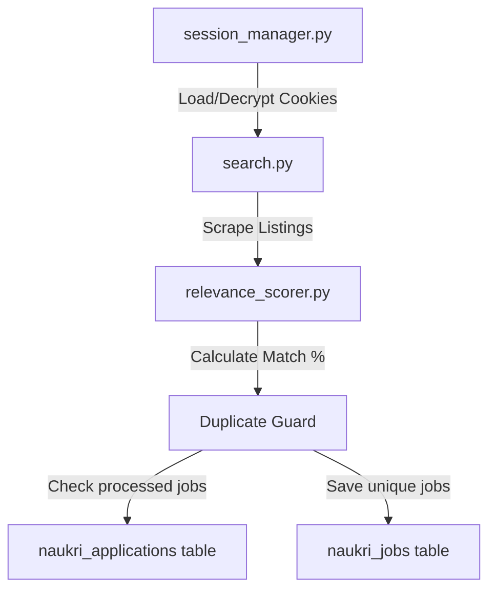

# Naukri AI Agent Module

The `naukri_agent` module is a fully automated job search, ranking, and persistence pipeline designed to find high-relevance vacancies on Naukri.com, score them against user preferences and resumes, and ensure zero duplicate applications are surfaced.

---

## Architecture Overview

The module consists of four primary components that interact in a sequential pipeline:



1. **Session & Authentication Manager** (`session_manager.py`):
   - Restores session cookies from disk, decrypting them via AES-256-GCM.
   - Navigates to a server-authenticated profile page to confirm session validity.
   - Orchestrates automated credentials login via Playwright and handles OTP/Captcha warnings.
2. **Scraper & Crawler Engine** (`search.py`):
   - Uses Playwright to navigate search slugs and queries.
   - Extracts job listings (title, company, skills, experience, location, URL, and job URN).
3. **Relevance Scorer Engine** (`relevance_scorer.py`):
   - Normalizes CV and job parameters (e.g. experience dates, location naming).
   - Evaluates a weighted multi-dimensional score (0-100%) checking:
     - **Skills** (40%): Set intersection + substring matches.
     - **Role Title** (30%): Substring match + token overlap ratio.
     - **Location** (15%): Matches preferred cities + Remote policies.
     - **Experience** (15%): Custom penalty scores for under/over-experience.
4. **Duplicate Guard & Persistence Layer** (`core/database.py`):
   - Declares the `naukri_jobs` and `naukri_applications` tables.
   - Deduplicates jobs using the `naukri_applications` tracking table (keyed by `(user_id, job_id)`).

---

## Setup & Configuration

### Prerequisites
1. Ensure python dependencies are installed:
   ```bash
   pip install -r requirements.txt
   playwright install
   ```
2. Make sure the database files (`users.db` and `jobs.db`) are initialized in the project root.

### User Configuration
The agent fetches credentials, target roles, locations, experience, and the candidate resume from `users.db`:
- **Credentials & Preferences**: Stored in the `users` table:
  - `naukri_preferences` JSON column containing:
    ```json
    {
      "roles": ["Python Developer", "React Engineer"],
      "locations": ["Bangalore", "Mumbai"],
      "experience": 3
    }
    ```
- **Resume Profile**: Stored in the `master_cv` table, containing work history start/end dates and a skills array.

---

## Visual Verification (Milestone 1.1)

We verified the module against all three Milestone 1.1 acceptance criteria using the verification script `naukri_agent/test_milestone_1_1.py`.

### 1. Job Discovery & Relevance Ranking
Scraped jobs are evaluated and sorted in descending order of relevance. Below is the visual representation of scored listings:


### 2. Persistent Duplicate-Application Guard
A dedicated `naukri_applications` table records every surfaced job. 
- **First Scan**: Surfaces and records all new jobs.
- **Subsequent Scans**: Checks each job ID against the database, filtering out already surfaced listings (returning `0` new duplicates).

### 3. Graceful Session Expiry & Re-authentication Alert
If session cookies expire or are deleted, the session check fails and immediately prompts the user with a clear alert to launch the credentials verification CLI tool:


The script also validates the login interface:


