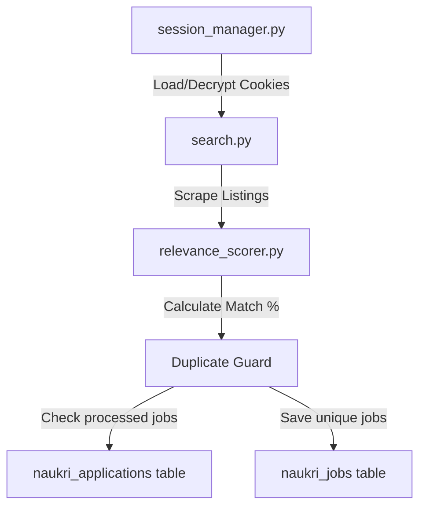

# Naukri AI Agent Module

The `naukri_agent` module is a fully automated job search, ranking, and persistence pipeline designed to find high-relevance vacancies on Naukri.com, score them against user preferences and resumes, and ensure zero duplicate applications are surfaced.

---

## Architecture Overview

The module consists of four primary components that interact in a sequential pipeline:



1. **Session & Authentication Manager** (`session_manager.py`):
   - Restores session cookies from disk, decrypting them via AES-256-GCM.
   - Navigates to a server-authenticated profile page to confirm session validity.
   - Orchestrates automated credentials login via Playwright and handles OTP/Captcha warnings.
2. **Scraper & Crawler Engine** (`search.py`):
   - Uses Playwright to navigate search slugs and queries.
   - Extracts job listings (title, company, skills, experience, location, URL, and job URN).
3. **Relevance Scorer Engine** (`relevance_scorer.py`):
   - Normalizes CV and job parameters (e.g. experience dates, location naming).
   - Evaluates a weighted multi-dimensional score (0-100%) checking Skills (40%), Role Title (30%), Location (15%), and Experience (15%).
4. **Resume Selection & Tailoring Engine** (`resume_tailor.py`):
   - Automatically classifies a job's target role family (e.g., "Backend Developer", "Product Manager") matching the keys of the user's CV variants.
   - Merges variant-specific overrides (headline, custom skills, tailored role responsibilities/achievements) with the base Master CV profile.
   - Rephrases bullet points dynamically with Claude if `ANTHROPIC_API_KEY` is present.
   - Compiles print-ready HTML applying a custom shared template (if provided at `resumes/shared_template.html`) or falling back to a premium A4 layout styled exactly like `resumes/IITIIMJobAssistant_SampleCV.pdf`.
   - Exports the tailored resume as a high-fidelity PDF to `resumes/generated/naukri_tailored_{user_id}_{job_id}.pdf`.
5. **Duplicate Guard & Persistence Layer** (`core/database.py`):
   - Declares the `naukri_jobs` and `naukri_applications` tables.
   - Deduplicates jobs using the `naukri_applications` tracking table (keyed by `(user_id, job_id)`).
   - Tracks the absolute path of the generated tailored resume in the `tailored_resume_path` column of `naukri_applications`.

---

## Setup & Configuration

### Prerequisites
1. Ensure python dependencies are installed:
   ```bash
   pip install -r requirements.txt
   playwright install
   ```
2. Make sure the database files (`users.db` and `jobs.db`) are initialized in the project root.

### User Configuration
The agent fetches credentials, target roles, locations, experience, and the candidate resume from `users.db`:
- **Credentials & Preferences**: Stored in the `users` table:
  - `naukri_preferences` JSON column containing:
    ```json
    {
      "roles": ["Python Developer", "React Engineer"],
      "locations": ["Bangalore", "Mumbai"],
      "experience": 3
    }
    ```
- **Resume Profile**: Stored in the `master_cv` table, containing work history start/end dates and a skills array.

---

## Visual Verification (Milestone 1.1)

We verified the module against all three Milestone 1.1 acceptance criteria using the verification script `naukri_agent/test_milestone_1_1.py`.

### 1. Job Discovery & Relevance Ranking
Scraped jobs are evaluated and sorted in descending order of relevance. Below is the visual representation of scored listings:


### 2. Persistent Duplicate-Application Guard
A dedicated `naukri_applications` table records every surfaced job. 
- **First Scan**: Surfaces and records all new jobs.
- **Subsequent Scans**: Checks each job ID against the database, filtering out already surfaced listings (returning `0` new duplicates).

### 3. Graceful Session Expiry & Re-authentication Alert
If session cookies expire or are deleted, the session check fails and immediately prompts the user with a clear alert to launch the credentials verification CLI tool:


The script also validates the login interface:


---

## Resume Selection & Tailoring Validation

We verified the resume selection, variant override merging, and high-fidelity PDF generation pipeline using the automated test suite `naukri_agent/test_resume_tailor.py`.

### Key Validation Outcomes:
1. **Dynamic Classification**: Correctly maps job titles to defined role families (e.g. classifying `"Technical Product Manager - Mobile Apps"` as `"Product Manager"`, and `"Senior Python Backend Developer"` as `"Backend Developer"`).
2. **Override Merging**: Successfully overlays variant-specific details (e.g. customized headlines, matching skills, tailored roles, and responsibilities) onto the base Master CV structure.
3. **High-Fidelity PDF Generation**: Renders a premium single-page A4 resume matching the structure of `resumes/IITIIMJobAssistant_SampleCV.pdf` using Playwright print-to-PDF.
4. **Database Verification & Auditing**: Confirms that newly surfaced high-relevance jobs save the absolute path of the generated tailored resume (e.g., `resumes/generated/naukri_tailored_{user_id}_{job_id}.pdf`) in the `tailored_resume_path` column of `naukri_applications`.


---

## Screening Question Answer-Bank Component

To handle job screening forms, an **Answer-Bank** component was added to `naukri_agent`. It stores historical candidate answers, matches incoming screening questions, automatically generates proposed answers using the OpenAI API when a match is missing, and flags new entries for manual verification.

### 1. Database Schema
Stored in the `naukri_answer_bank` table inside `users.db`:
- `id` (INTEGER, PK)
- `user_id` (INTEGER, FK)
- `question` (TEXT, unique per user)
- `answer` (TEXT)
- `status` (TEXT: `'approved'` or `'pending_review'`)
- `updated_at` (TEXT)

### 2. Matching Algorithm
Incoming questions are resolved via:
1. **Normalization**: Clean punctuation, lowercasing, and whitespace compaction.
2. **Exact Cleaned Match**: Direct lookup against existing questions.
3. **High Token Overlap (Jaccard Similarity >= 0.70)**: Matches equivalent questions phrased differently (e.g. *"What is your total years of experience?"* matches *"What is your total experience in years?"*).

### 3. OpenAI Answer Generation & Flagging
When no match is found:
1. The component queries OpenAI API (`gpt-4o`) with the candidate's Master CV profile and preferences.
2. The AI formulates a professional response (e.g., extracting notice periods or CTC values).
3. The response is saved in the database with `status='pending_review'`.
4. The system flags this question for user review instead of auto-submitting unverified answers.

### 4. CRUD Interface & APIs
Endpoints exposed in `core/app.py`:
- `GET /api/users/<user_id>/answer-bank` — Retrieve all answer-bank entries.
- `POST /api/users/<user_id>/answer-bank` — Add or update an entry (body: `{ "question": "...", "answer": "...", "status": "approved" }`).
- `DELETE /api/users/<user_id>/answer-bank` — Delete an entry by question.

---

## Answer-Bank Validation

The answer-bank has been fully validated with the test suite `naukri_agent/test_answer_bank.py`:
- **Clean Normalization**: Verified normalization of special characters and spacing.
- **Match Accuracy**: Verified exact and fuzzy token matching.
- **OpenAI Integration**: Confirmed missing questions prompt OpenAI generation and persist with `pending_review` status.
---

## Core Auto-Apply Agent Component

The **Auto-Apply Agent** (`naukri_agent/applier.py`) ties together all sub-components to submit job applications end-to-end on the user's behalf.

### 1. Throttling and Anti-Bot Protections
To avoid triggering Naukri's anti-automation / bot-detection mechanisms:
- **Daily Caps**: Enforces a strict maximum number of submissions per day (default `5` applications, fully configurable via the API).
- **History Audit**: Queries the database to count successfully submitted applications today before launching browser instances, pausing early if the limit is reached.
- **Evasion Evasiveness**: Reuses Playwright headed Chromium configurations with custom evasions to disable `AutomationControlled` markers and spoof authentic navigator headers.

### 2. Auto-Fill Screening Questions
When applying to a job with screening questions:
1. Fetches all form questions dynamically.
2. Checks them against the user's Answer-Bank.
3. If any question is not approved (i.e., new and saved as `'pending_review'`), the agent:
   - Captures a screenshot of the form and saves it to `screenshots/naukri_review_{user_id}_{job_id}.png`.
   - Sets the application status in the database to `'pending_review'`.
   - Skips applying to this job to allow manual verification, ensuring no guesses or blank answers are submitted.
4. If all answers are approved, it automatically fills standard input textboxes, select dropdowns, and radio buttons.

### 3. Tailored Resume Upload
- Locates the resume upload field on the application modal/page.
- Automatically updates the application with the custom `tailored_resume_path` generated specifically for this job (having relevance $\ge 50\%$).

### 4. API Endpoints
- `POST /api/users/<user_id>/naukri-apply` — Triggers the auto-apply pipeline for the user. Accepts JSON: `{ "max_daily_apps": 5 }`. Returns `{ "ok": true, "result": { ... } }`.

---

## Auto-Apply Agent Validation

The auto-apply agent is verified by `naukri_agent/test_applier.py`:
- **Throttling Verification**: Asserts that execution halts when daily capacity has been exhausted.
- **Form Fill & Flags**: Verifies that jobs with approved answers are fully submitted, while jobs with pending answers are correctly flagged as `'pending_review'` and snapshotted.
- **Flask API Route**: Validates the Flask app trigger route under `app.test_client()`.

